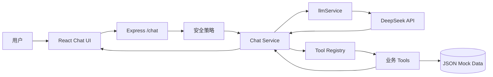
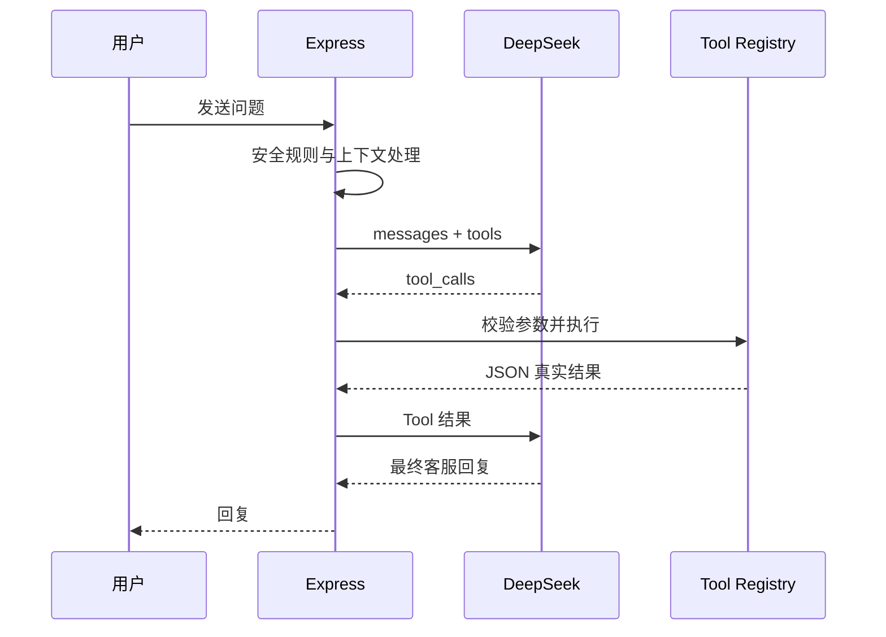

# EcommerceAgent

[](https://github.com/ACCS-0521/EcommerceAgent/actions/workflows/ci.yml)
[](LICENSE)
[](https://nodejs.org/)
[](https://www.typescriptlang.org/)

基于 DeepSeek Tool Calling 的智能电商客服 MVP。项目以“先跑通、不过度设计”为原则，使用 JSON Mock 数据完成商品咨询、订单物流查询、优惠券、FAQ、售后规则和人工转接。

## 项目亮点

- 8 个可测试的业务 Tool，所有业务数据只读取自 `data/`
- DeepSeek 调用统一封装在 `server/services/llmService.ts`
- 标准 Tool Calling 循环：模型决策、工具执行、结果回传、最终回复
- 投诉、赔偿、法律、账号异常和连续失败确定性转人工
- 提示词攻击、隐私查询和越权操作在模型调用前拒绝
- 内存多轮上下文，可复用订单号和物流单号
- JSON 动态生成演示快捷入口，无需记忆测试编号
- React 响应式聊天页面，支持移动端、加载态和错误提示
- 后端、Tool、安全策略、路由与前端组件均有自动化测试

> 本项目是智能客服 Agent MVP 演示，不连接真实电商平台，不处理真实订单。Mock 数据和 AI 回复不能替代真实商家客服、法律意见、财务结算或平台官方规则。

## 系统架构



## Agent 工作流



## 功能范围

| 功能 | Tool / 处理方式 |
| --- | --- |
| 商品查询 | `getProduct` |
| 商品推荐 | `recommendProduct` |
| 订单查询 | `getOrder` |
| 物流查询 | `getLogistics` |
| 优惠券查询 | `getCoupon` |
| FAQ | `getFaq` |
| 售后规则 | `getRefundPolicy` |
| 人工转接 | `transferToHuman` |

本阶段不包含数据库、登录、JWT、RAG、后台管理、Docker、消息队列或多 Agent。

## 技术栈

- 前端：React、Vite、TypeScript、TailwindCSS
- 后端：Node.js、Express、TypeScript
- 模型：DeepSeek `deepseek-v4-flash`
- Agent：Function Calling / Tool Calling
- 数据：JSON 文件
- 测试：Vitest、Testing Library、Supertest

## 快速开始

### 环境要求

- Node.js 20+
- pnpm 10+
- DeepSeek API Key

### 安装

```bash
git clone https://github.com/ACCS-0521/EcommerceAgent.git
cd EcommerceAgent
pnpm install
```

复制环境变量模板：

```bash
cp .env.example .env
```

编辑 `.env`：

```env
PORT=3000
DEEPSEEK_API_KEY=your_deepseek_api_key
DEEPSEEK_BASE_URL=https://api.deepseek.com
DEEPSEEK_MODEL=deepseek-v4-flash
```

不要提交 `.env` 或 API Key。

### 启动

后端：

```bash
pnpm dev
```

另一个终端启动前端：

```bash
pnpm dev:web
```

访问 http://localhost:5173。

## API

### 健康检查

```bash
curl http://localhost:3000/health
```

### 演示案例

```bash
curl http://localhost:3000/demo/examples
```

### 聊天

```bash
curl -X POST http://localhost:3000/chat \
  -H 'Content-Type: application/json' \
  -d '{"message":"查询订单 ORD202600001"}'
```

后续消息传回响应中的 `conversationId`，即可在当前进程内延续上下文。

## 项目结构

```text
EcommerceAgent/
├── data/                 # 商品、订单、物流、优惠券和规则 Mock 数据
├── docs/                 # 系统提示词、Tool 和测试说明
├── server/
│   ├── agent/            # 安全策略、系统提示词和 Tool Registry
│   ├── services/         # Chat、DeepSeek 和演示服务
│   ├── tools/            # 8 个 JSON 业务 Tool
│   └── routes/           # health、chat、demo API
├── tests/                # 后端、Tool、意图和边界测试
├── web/                  # React + Vite 聊天页面
└── .github/              # CI、Dependabot、Issue 和 PR 模板
```

## 测试与构建

```bash
pnpm test
pnpm typecheck
pnpm build
pnpm test:web
pnpm build:web
```

普通测试不会调用真实 DeepSeek API。需要真实验证 `tests/intent_cases.json` 时运行：

```bash
pnpm test:live-intents
```

该命令会产生 API 用量。

## MVP 限制

- 会话仅保存在进程内，服务重启后丢失。
- `coupons.json` 没有用户绑定字段，当前返回全站可用且未过期优惠券。
- DeepSeek Strict Tool Calling 仍属 Beta，本阶段使用标准 Tool Calling。
- 当前没有部署在线 Demo，需要在本地配置 DeepSeek API Key 运行。

## 数据、隐私与 AI 边界

- `data/` 中的商品、订单、物流、优惠券、FAQ 和售后规则都是 Mock 数据。
- 本地配置 DeepSeek API Key 后，聊天内容会发送到配置的 DeepSeek API 地址。
- 请勿在演示中输入真实个人敏感信息、真实订单、真实物流单号或商业机密。
- `.env`、API Key、访问令牌、私钥、真实用户数据和调试日志不得提交到仓库。

完整说明见 [内容、数据、AI 与隐私说明](CONTENT_NOTICE.md)。

## Roadmap

- Phase 2：数据库、用户系统和历史记录持久化
- Phase 3：Embedding、Qdrant、RAG 和知识库
- Phase 4：销售、售后、运营和主管多 Agent

Roadmap 仅描述后续方向，不属于当前 MVP。

## 安全与贡献

- 安全问题请阅读 [SECURITY.md](SECURITY.md)，不要创建公开漏洞 Issue。
- 参与贡献请阅读 [CONTRIBUTING.md](CONTRIBUTING.md) 和 [CODE_OF_CONDUCT.md](CODE_OF_CONDUCT.md)。
- Bug 和功能建议请使用仓库的 Issue 模板。
- Pull Request 请遵循自动生成的检查清单，并确保 CI 通过。

## License

程序代码采用 [MIT License](LICENSE)。Mock 数据、第三方服务名称和外部链接的权利边界见 [CONTENT_NOTICE.md](CONTENT_NOTICE.md)。
